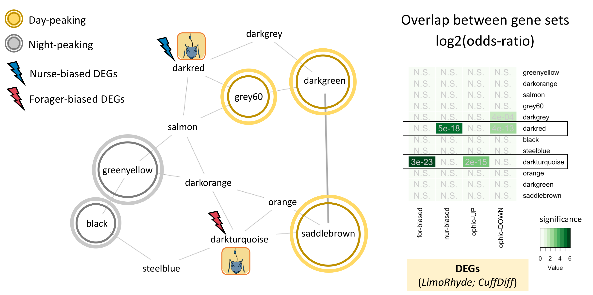

```{r setup, include=FALSE}
knitr::opts_chunk$set(echo = TRUE)
knitr::opts_chunk$set(warning = F)
knitr::opts_chunk$set(message = F)

## For more inspiration on customizing the html output, refer to the following:
# https://bookdown.org/yihui/rmarkdown/html-document.html#table-of-contents

```

```{r housekeeping, include=FALSE}
set.seed(420)
rm(list = ls())

#' Load the libraries
pacman::p_load(pheatmap, dendextend, tidyverse, viridis)
pacman::p_load(RSQLite, tidyverse, dbplyr, DT, conflicted, WGCNA, igraph)
pacman::p_load(patchwork)

#' set conflict preference
conflict_prefer("select", "dplyr")
conflict_prefer("filter", "dplyr")
conflict_prefer("layout", "plotly")
conflict_prefer("hclust", "flashClust")

#' set path to your working directory
path_to_repo = "/Users/biplabendudas/Documents/GitHub/Das_and_deBekker_2021"

#' load functions
# customized theme for publication quality figures
source(paste0(path_to_repo,"/functions/theme_publication.R"))
# function to perform enrichment analysis
source(paste0(path_to_repo,"/functions/enrichment_analysis.R"))
# function to plot z-scores (Cflo genes only)
source(paste0(path_to_repo,"/functions/plot_zscores.R"))

```


## Overview/Goals

This document provides a step-by-step tutorial on how to: 
- build a circadian gene co-expression network (GCN), 
- how to annotate the network using published data,
- infer functions of your gene-clusters-of-interest.

## Step 1: Build circadian GCN

### 1.1 Load data

We will build a circadian GCN for the ant, *Camponotus floridanus*, using time-course RNASeq data collected in Das and de Bekker (2021; bioRxiv). The raw data is deposited on NCBI under accession number **XXXX**. 

DESCRIBE THE DATA HERE (briefly)

One would need to perform the usual steps - trimming the reads, mapping the reads to the genome, and quantifying normalized gene counts - to obtain normalized gene expression data from the raw reads. At the end, for each gene in the genome, we should have the normalized expression for each time point, throughout the 24h day.

For the purpose of this tutorial, we assume that you have organized the processed data into a (gene-expr X time-point) format as shown below.

```{r load_data}
# loading database which contains data for Das and de Bekker 2021 (bioRxiv)
db <- dbConnect(RSQLite::SQLite(), paste0(path_to_repo,"/data/databases/TC5_data.db"))

# extract the (gene-expr X time-point) data
dat <-
  db %>%
  tbl(., "annot_fpkm") %>%
  select(gene_name, X2F:X24N) %>%
  collect()

dim(dat)

```

### 1.2 Clean data

The above dataset contains all genes (n=13,813) in the ant genome. 
However, not all of these genes are expressed in the ant brain, and some are expressed at very low levels that are not biologically meaningful. Therefore, we will only keep the genes that are "expressed" (≥1 FPKM) in the ant brain, for at least half of all the sampled time points.

```{r clean_data}
# Which genes are expressed throughout the day in both forager and nurses brains?
daily.exp.genes <-
  tbl(db, "expressed_genes") %>% # note, the information is already available in the database
  filter(exp_half_for == "yes" & exp_half_nur == "yes") %>%
  collect() %>%
  pull(gene_name)

# Subset the gene-expr X time-point file
dat <- dat %>% filter(gene_name %in% daily.exp.genes)
dim(dat)

```

This is our cleaned, input data file. 
The daily expression for these 9139 genes that will be used to create the circadian GCN of *Camponotus floridanus*.

### 1.3 Format data

- Log2 transform the data

```{r format_data}

datExpr = as.data.frame(t(log2(dat[-c(1)]+1)))
names(datExpr) = dat$gene_name
rownames(datExpr) = names(dat)[-c(1)]

# USE THE FOLLOWING CODE TO CHECK IF YOU HAVE ANY BAD SAMPLES #
  # gsg = goodSamplesGenes(datExpr0, verbose = 3);
  # gsg$allOK
  #
  # sampleTree = hclust(dist(datExpr0), method = "average");
  # # Plot the sample tree: Open a graphic output window of size 12 by 9 inches
  # # The user should change the dimensions if the window is too large or too small.
  # sizeGrWindow(12,9)
  # #pdf(file = "Plots/sampleClustering.pdf", width = 12, height = 9);
  # par(cex = 1);
  # par(mar = c(0,4,2,0))
  # plot(sampleTree, main = "Sample clustering to detect outliers", sub="", xlab="", cex.lab = 1.5,
  #      cex.axis = 1.5, cex.main = 2)

# save the number of genes and samples
# that will be used to create the circadian GCN
nGenes = ncol(datExpr)
nSamples = nrow(datExpr)

# visualize the log-transformed data
x = reshape2::melt(as.matrix(t(datExpr)))
colnames(x) = c('gene_id', 'sample', 'value')
ggplot(x, aes(x=value, color=sample)) + geom_density() + theme_Publication()

```

### 1.4 Calculate gene-gene similarity

```{r gene_sim_matrix}
## Calculate Kendall's tau-b correlation for each gene-gene pair
#
# sim_matrix <- cor((datExpr), method = "kendall") # this step takes time
# save(sim_matrix, file = paste0(path_to_repo, "/results/temp_files/sim_matrix_for_nur_TC5.RData")) # might be useful to save the sim_matrix and
load(paste0(path_to_repo, "/results/temp_files/sim_matrix_for_nur_TC5.RData")) # load it up

## Let's display a chunk of the matrix (code from Hughitt 2016; github)
heatmap_indices <- sample(nrow(sim_matrix), 500)
gplots::heatmap.2(t(sim_matrix[heatmap_indices, heatmap_indices]),
          col=inferno(100),
          labRow=NA, labCol=NA,
          trace='none', dendrogram='row',
          xlab='Gene', ylab='Gene',
          main='Similarity matrix \n correlation method = "kendall" \n (500 random genes)',
          density.info='none', revC=TRUE)

```

### 1.5 Create adjacency matrix

- To create the adjacency matrix, we need to first identify the soft-thresholding power

```{r soft_thresholding_power}
# Choose a set of soft-thresholding powers
powers = c(c(1:10), seq(from = 12, to=20, by=2))
# # Call the network topology analysis function
sft = pickSoftThreshold(datExpr, powerVector = powers, verbose = 5)
# Plot the results:
# sizeGrWindow(9, 5)
# par(mfrow = c(1,2));
cex1 = 0.9;
# Scale-free topology fit index as a function of the soft-thresholding power
plot(sft$fitIndices[,1], -sign(sft$fitIndices[,3])*sft$fitIndices[,2],
     xlab="Soft Threshold (power)",ylab="Scale Free Topology Model Fit,signed R^2",type="n",
     main = paste("Scale independence"));
text(sft$fitIndices[,1], -sign(sft$fitIndices[,3])*sft$fitIndices[,2],
     labels=powers,cex=cex1,col="red");
# this line corresponds to using an R^2 cut-off of h
abline(h=0.90,col="red")
# Mean connectivity as a function of the soft-thresholding power
plot(sft$fitIndices[,1], sft$fitIndices[,5],
     xlab="Soft Threshold (power)",ylab="Mean Connectivity", type="n",
     main = paste("Mean connectivity"))
text(sft$fitIndices[,1], sft$fitIndices[,5], labels=powers, cex=cex1,col="red")

```

NOTE: The scale-free topology fit index reaches ~0.9 at a soft-thresholding-power=9, and it does not improve drastically beyond that.

Now, we can go ahead and create our adjacency matrix.

```{r adjacency_matrix}
## Specify the soft-thresholding-power
soft.power = 9

## Construct adjacency matrix
# adj_matrix <- adjacency.fromSimilarity(sim_matrix,
#                                        power=soft.power,
#                                        type='signed'
#                                         )
# save(adj_matrix, file = paste0(path_to_repo, "/results/temp_files/adj_matrix_for_nur_TC5.RData")) # might be useful to save the sim_matrix and
load(paste0(path_to_repo, "/results/temp_files/adj_matrix_for_nur_TC5.RData")) # load it up


# Convert adj_matrix to matrix
gene_ids <- rownames(adj_matrix)

adj_matrix <- matrix(adj_matrix, nrow=nrow(adj_matrix))
rownames(adj_matrix) <- gene_ids
colnames(adj_matrix) <- gene_ids

## Same heatmap as before, but now with the power-transformed adjacency matrix
gplots::heatmap.2(t(adj_matrix[heatmap_indices, heatmap_indices]),
                  col=inferno(100),
                  labRow=NA, labCol=NA,
                  trace='none', dendrogram='row',
                  xlab='Gene', ylab='Gene',
                  main='Adjacency matrix',
                  density.info='none', revC=TRUE)

## Delete similarity matrix to free up memory
rm(sim_matrix)
gc()

```

***

## Step 2: Identify gene clusters

### 2.1 Create topological overalp matrix

```{r adj_to_TOM}
# Turn adjacency into topological overlap
# TOM = TOMsimilarity(adj_matrix);
# dissTOM = 1-TOM
# save(dissTOM, file = paste0(path_to_repo, "/results/temp_files/dissTOM_for_nur_TC5.RData")) # might be useful to save the sim_matrix and
load(paste0(path_to_repo, "/results/temp_files/dissTOM_for_nur_TC5.RData")) # load it up

# Call the hierarchical clustering function
geneTree = hclust(as.dist(dissTOM), method = "average")

# Plot the resulting clustering tree (dendrogram)
# sizeGrWindow(12,9)
plot(geneTree, xlab="", sub="", main = "Gene clustering on TOM-based dissimilarity",
     labels = FALSE, hang = 0.04)

```

### 2.2 Identify clusters

```{r identify_clusters}
# We like large modules, so we set the minimum module size relatively high:
minModuleSize = 30;

# Module identification using dynamic tree cut:
dynamicMods= cutreeDynamic(dendro = geneTree,
                           distM = dissTOM,
                           method = "hybrid",
                           verbose = 4,
                           deepSplit = 3, # see WGCNA for more info on tuning parameters
                           pamRespectsDendro = FALSE,
                           minClusterSize = minModuleSize);

# view number of genes in each module
table(dynamicMods)

# Convert numeric lables into colors
dynamicColors = labels2colors(dynamicMods)
table(dynamicColors)

```

### 2.3 Merge similar modules

```{r refine_cluster}
# Calculate eigengenes
MEList = moduleEigengenes(datExpr, colors = dynamicColors)
MEs = MEList$eigengenes

# Calculate dissimilarity of module eigengenes
MEDiss = 1-cor(MEs, method = "kendall");

# Cluster module eigengenes
METree = hclust(as.dist(MEDiss), method = "average");
# Plot the result
# sizeGrWindow(7, 8)
plot(METree, main = "Clustering of module eigengenes",
     xlab = "", sub = "MEDiss = 1-cor(MEs, method = 'kendall')")

# We choose a height cut of 0.2, corresponding to correlation of 0.8, to merge
MEDissThres = 0.2 # user-specified parameter value; see WGCNA manual for more info

# Plot the cut line into the dendrogram
abline(h=MEDissThres, col = "red")

# Call an automatic merging function
merge = mergeCloseModules(datExpr, dynamicColors, cutHeight = MEDissThres, verbose = 3)

# The merged module colors
mergedColors = merge$colors;
# Eigengenes of the new merged modules:
mergedMEs = merge$newMEs;

# sizeGrWindow(12, 9)
plotDendroAndColors(geneTree,
                    cbind(dynamicColors, mergedColors),
                    c("Dynamic Tree Cut", "Merged dynamic"),
                    dendroLabels = FALSE, hang = 0.03,
                    addGuide = TRUE, guideHang = 0.05)

# Rename to moduleColors
moduleColors = mergedColors

# Construct numerical labels corresponding to the colors
colorOrder = c("grey", standardColors(50));
moduleLabels = match(moduleColors, colorOrder)-1

```

### 2.4 Calculate module-module similarity

```{r module_sim_matrix}
# Calculate similarity of the eigen-genes
sim_matrix_ME <- cor(mergedMEs, method = "kendall")

# calculate adj_matrix
adj_matrix_ME <- adjacency.fromSimilarity(sim_matrix_ME,
                                          power=1, # DO NOT power transform
                                          type='signed'
)

# coerce into a matrix
gene_ids <- rownames(adj_matrix_ME)
adj_matrix_ME <- matrix(adj_matrix_ME, nrow=nrow(adj_matrix_ME))
rownames(adj_matrix_ME) <- gene_ids
colnames(adj_matrix_ME) <- gene_ids

gplots::heatmap.2(t(adj_matrix_ME),
                  col=inferno(100),
                  # labRow=NA, labCol=NA,
                  trace='none', dendrogram='row',
                  xlab='', ylab='',
                  # main='Similarity matrix - MEs \n correlation method = "kendall")',
                  main='Adjacency matrix - MEs \n modified edge weights)',
                  density.info='none', revC=TRUE)


```

### 2.5 Visualize the network

```{r visualize_network}
pacman::p_load(igraph)

# get rid of low correlations (0.6 & 0.8 are arbitrary)
adj_matrix_ME[adj_matrix_ME < 0.6] <- 0
adj_matrix_ME[adj_matrix_ME < 0.8 & adj_matrix_ME>0] <- 0.5
adj_matrix_ME[adj_matrix_ME >= 0.8] <- 1

# build_network
network <- graph.adjacency(adj_matrix_ME,
                           mode = "upper",
                           weighted = T,
                           diag = F)

# simplify network
network <- igraph::simplify(network)  # removes self-loops

# E(network)$width <- E(network)$weight + min(E(network)$weight) + 1 # offset=1

colors <- mergedMEs %>% names() %>% str_split("ME", 2) %>% sapply("[", 2)
V(network)$color <- colors

genes_ME <- factor(moduleColors, levels=colors) %>% summary()
V(network)$size <- log2(genes_ME)*2

V(network)$label.color <- "black"
V(network)$frame.color <- "white"

E(network)$width <- E(network)$weight^2*4
E(network)$edge.color <- "gray80"

# par(mar=c(0,0,0,0))
# remove unconnected nodes
# network <- delete.vertices(network, degree(network)==0)
# plot(network,
#      layout=layout.fruchterman.reingold
#      # layout = layout.kamada.kawai
#      # layout = layout.kamada.kawai
#      )


## Circular layout
plot(network,
     layout=layout.kamada.kawai
       # layout=layout.fruchterman.reingold
       # layout=layout.graphopt
       # layout=layout_in_circle,
     # vertex.label=NA
     # vertex.size=hub.score(network)$vector*30
     # vertex.shape="none"
)

```

## Step 3: Annotate the network

### 3.1 Define your genes of interest

```{r define_genes_of_interest}

# DEFINE GENES OF INTEREST

rhy.trait.24 <- tbl(db, "ejtk_all") %>% select(gene_name:rhy) %>% collect()
# pull the genes
for.rhy <- rhy.trait.24 %>% filter(caste=="for" & rhy=="yes") %>% pull(gene_name)
nur.rhy <- rhy.trait.24 %>% filter(caste=="nur" & rhy=="yes") %>% pull(gene_name)
rhy.genes <- dplyr::union(for.rhy, nur.rhy)

rhy.trait.8 <- tbl(db, "ejtk_8h_all") %>% select(gene_name:rhy) %>% collect()
for.rhy.8 <- rhy.trait.8 %>% filter(caste=="for" & rhy=="yes") %>% pull(gene_name)
nur.rhy.8 <- rhy.trait.8 %>% filter(caste=="nur" & rhy=="yes") %>% pull(gene_name)

rhy.trait.12 <- tbl(db, "ejtk_12h_all") %>% select(gene_name:rhy) %>% collect()
for.rhy.12 <- rhy.trait.12 %>% filter(caste=="for" & rhy=="yes") %>% pull(gene_name)
nur.rhy.12 <- rhy.trait.12 %>% filter(caste=="nur" & rhy=="yes") %>% pull(gene_name)

# DRGs
for24.nur8 <- intersect(for.rhy, nur.rhy.8)

```

### 3.2 Where are my genes of interest located?

```{r find_genes_in_network_1}
pacman::p_load(GeneOverlap)
# https://www.bioconductor.org/packages/devel/bioc/vignettes/GeneOverlap/inst/doc/GeneOverlap.pdf

# Make a list that returns gene names for a given cluster
module_color = colors
module = names(mergedMEs)
module_colors <-
  data.frame(module_label=module) %>%
  mutate(module_color = str_replace(module_label, "ME", ""))

module_genes <- list()
module_color <- module_colors$module_color
# Get the genes from each of the modules
for (i in 1:length(module_color)) {

  module_genes[[i]] <- names(datExpr)[which(moduleColors==module_color[[i]])]
  names(module_genes)[[i]] <- module_color[[i]]
}
# check the result | works
names(module_genes)
# module_genes['salmon']


## MAKE YOUR LIST OF GENES OF INTEREST ##

# LIST ONE - WGCNA modules
list1 <- module_genes
sapply(list1, length)

## LIST TWO - rhythmic genes
list2 <- list(for.rhy, nur.rhy, rhy.genes, intersect(for.rhy, nur.rhy), for24.nur8)
names(list2) <- c("for24", "nur24", "all.rhy24","for24.nur24", "for24.nur8")
sapply(list2, length)


## CHECK FOR OVERLAP

## make a GOM object
gom.1v2 <- newGOM(list1, list2,
       genome.size = nGenes)
png(paste0(path_to_repo, "/results/figures/gom_1v2.png"), 
    width = 20, height = 18, units = "cm", res = 300)
drawHeatmap(gom.1v2,
              adj.p=T,
              cutoff=0.05,
              what="odds.ratio",
              # what="Jaccard",
              log.scale = T,
              note.col = "grey80")
dev.off()

```


```{r plot_gom_1v2, echo = FALSE, fig.align='center', fig.cap='Gene-clusters with 24h-rhythmic genes'}
knitr::include_graphics("./../results/figures/gom_1v2.png")
```

The above plot shows the gene-clusters that contain most of our 24h-rhythmic genes of interest.

HOW TO READ THE FIGURE?
- Briefly explain here
- Talk about Odds-Ratio
- Darker the green, more significant is the overlap (also indicated by the adj_pval)

Next, we can try to identify the ant gene-clusters that underlie behavioral plasticity, as well as the ant clusters that are affected during behavioral manipulation induced by *Ophiocordyceps*.

```{r find_genes_in_network_2}
## Genes underlying behavioral plasticity
  ## DEGS (foragers v. nurses)
  # genes higher expressed in forager brains (v. nurse brains)
  for.up <- tbl(db, "TC5_DEGs_all") %>% filter(upregulation=="for") %>% collect() %>% pull(gene_name)
  # genes lower expressed in for. brains (v. nurse brains)
  for.down <- tbl(db, "TC5_DEGs_all") %>% filter(upregulation=="nur") %>% collect() %>% pull(gene_name)

## Genes underlying parasite-induced behavioral manipulation
  ## DEGs (ophio-ant v. control-ant)
  ophio.dat <- tbl(db, "ophio_biting_control") %>% collect() %>% select(gene, value_1, value_2, q_value:logFC)
  ophio.dat <- ophio.dat %>%
    filter(abs(logFC) >= 1 & significant=="yes" & q_value < 0.05) %>%
    mutate(ophio = ifelse(logFC > 0, "down", "up"))
  # genes higher expressed in ant heads during Ophio-manipulated biting (v. controls)
  ophio.up <- ophio.dat %>% filter(ophio=="up") %>% pull(gene)
  # genes lower expressed in ant heads during manipulated biting (v. controls)
  ophio.down <- ophio.dat %>% filter(ophio=="down") %>% pull(gene)

## LIST THREE - genes underlying behavioral plasticity and parasitic behavioral manipulation
list3 <- list(for.up, for.down, # same as list three
              ophio.up, ophio.down)
names(list3) <- c("for-UP", "for-DOWN",
                  "ophio-UP", "ophio-DOWN")

## CHECK FOR OVERLAP

## make a GOM object
gom.1v3 <- newGOM(list1, list3,
       genome.size = nGenes)
## visualize the overlaps
png(paste0(path_to_repo, "/results/figures/gom_1v3.png"), 
    width = 20, height = 18, units = "cm", res = 300)
drawHeatmap(gom.1v3,
              adj.p=T,
              cutoff=0.05,
              what="odds.ratio",
              # what="Jaccard",
              log.scale = T,
              note.col = "grey80")
dev.off()

```

```{r plot_gom_1v3, echo = FALSE, fig.align='center', fig.cap='Gene-clusters underlying behavioral plasiticity and parasitic behavioral manipulation'}
knitr::include_graphics("./../results/figures/gom_1v3.png")
```

The figure above clearly indicates that the gene-clusters that underlie behavioral plasticity (caste differentiation) and the ones that are affected during *Ophiocordycpes*-induced behavioral manipulation are the same. 

**In other words, to induce the characteristic manipulated biting behavior, the manipulating fungal parasite seems to be targeting the same genes and processes that otherwise allow ants to display behavioral plasticity.**

```{r plot_annotated_network, echo = FALSE, fig.align='center', fig.cap='Annotated circadian GCN', out.width="85%"}


```


## Step 4: Explore your clusters-of-interest

### 4.1 Cluster: DARKTURQUOISE

#### 4.1.1 What are these overlapping genes?

- Let's focus on the cluster darkturquoise that contains most Cflo genes that:
  - are sig. higher expressed in foragers (v. nurses) and 
  - are sig. up-regulated in forager heads during behavioral manipulation (v. uninfected foragers)

```{r explore_darkturquoise_part1}

# specify our cluster of interest (coi)
coi.1 <- "darkturquoise"
# How many genes are there in the cluster?
module_genes[[coi.1]] %>% length() # n = 209 genes

# specify our genes of interest (goi)
goi.1 <- ophio.up
# how many genes are there in the gene-set?
goi.1 %>% length() # n = 232 genes

# Identify overlapping genes
overlapping.genes.1 <- intersect(module_genes[[coi.1]], goi.1) # n = 32 genes
# what are these genes?
overlapping.genes.1.annot <- 
  db %>% 
  tbl(., "annot_fpkm") %>% 
  filter(gene_name %in% overlapping.genes.1) %>% 
  select(gene_name, 
         blast_annot=old_annotation, 
         GOs, pfams, signalP, TMHMM) %>% 
  collect()

# Visualize the results
DT::datatable(overlapping.genes.1.annot, options = list(
  pageLength = 5,
  lengthMenu = c(5, 10, 15, 20)
))
  
```

Which genes in darkturquoise show overlap with both genes of interests?

```{r explore_darkturquoise_part2}

# define the second gene-set of interst
goi.2 <- for.up
# how many genes are up-regulated during manipulation?
goi.2 %>% length() # n = 34 genes

# Identify overlapping.genes
overlapping.genes.2 <- intersect(overlapping.genes.1, goi.2) # n = 10 genes
# what are these genes?
overlapping.genes.2.annot <- 
  db %>% 
  tbl(., "annot_fpkm") %>% 
  filter(gene_name %in% overlapping.genes.2) %>% 
  select(gene_name, 
         blast_annot=old_annotation, 
         GOs, pfams, signalP, TMHMM) %>% 
  collect()

# Visualize the results
DT::datatable(overlapping.genes.2.annot, options = list(
  pageLength = 5,
  lengthMenu = c(5, 10, 15, 20)
))

```


#### 4.1.2 What's special about my cluster?

Now that we know that the module **darkturquoise** contains most of our genes of interest, we can infer its function (enriched GOs and PFAMs) and also identify the genes that are important for the cluster to be functional (i.e., hub genes).

This is the primary advantage of systems-level analysis:
- Use different sources of evidence to identify the clusters in the network that are of interest,
- Analyze the cluster-of-interest

#### 4.1.3 Enriched GO terms

First up, let's see which processes are overrepresented in the cluster.

```{r explore_darkturquoise_v3}

# To run a functional enrichment analyis, we first need to define the set of background genes; for our purpose, we will use the 9139 genes that we used to build our circadian GCN
bg.genes <- dat %>% pull(gene_name)

# Run the enrichment function (note, GO HERE TO READ MORE ABOUT THIS FUNCTION)
go_enrichment(geneset = module_genes[[coi.1]],
              function.dir = path_to_repo,
                org = "cflo", 
                bg = bg.genes) %>% 
  
  # visualize the results
  go_enrichment_plot(function.dir = path_to_repo)

```

#### 4.1.4 Daily rhythms?

Second, let's plot the daily expression patterns of all genes in the cluster, for nurses and foragers.

```{r explore_darkturquoise_v4}

# Obtain the stacked z-plots for nurses (blue) and foragers (red)
zplots.darkturquoise <- 
  module_genes[[coi.1]] %>% 
  stacked.zplot()

# Plot them side by side
zplots.darkturquoise[[1]] / zplots.darkturquoise[[2]]

```

LEGEND: **RED** = Forager brains, **BLUE** = Nurse brains

#### 4.1.5 HUB genes?
 
Need to:
- identify the hub genes in the darkturquoise cluster
- other genes of interest based on their location in the network?


### 4.2 Cluster: DARKRED

#### 4.2.1 Overlapping genes

```{r explore_darkred_v1, echo=F}
# specify our cluster of interest (coi)
coi.2 <- "darkred"

# specify our genes of interest (goi)
goi.3 <- ophio.down

# Identify overlapping genes
overlapping.genes.3 <- intersect(module_genes[[coi.2]], goi.3)

# define the second gene-set of interst
goi.4 <- for.down

# Identify overlapping.genes
overlapping.genes.4 <- intersect(overlapping.genes.3, goi.4) 

# what are these genes?
overlapping.genes.4.annot <- 
  db %>% 
  tbl(., "annot_fpkm") %>% 
  filter(gene_name %in% overlapping.genes.4) %>% 
  select(gene_name, 
         blast_annot=old_annotation, 
         GOs, pfams, signalP, TMHMM) %>% 
  collect()

# Visualize the results
DT::datatable(overlapping.genes.4.annot, options = list(
  pageLength = 5,
  lengthMenu = c(5, 10, 15, 20)
))

```

#### 4.2.2 Enriched GO terms

```{r explore_darkred_v2, echo=F}

# which genes?
module_genes[[coi.2]] %>% 
  
  # run enrichment
  go_enrichment(.,
              function.dir = path_to_repo,
                org = "cflo", 
                bg = bg.genes) %>% 
  
  # visualize the results
  go_enrichment_plot(function.dir = path_to_repo)

```

#### 4.2.3 Daily rhythms?

```{r explore_darkred_v3, echo=F}

# Obtain the stacked z-plots for 
# nurses (blue) and foragers (red)
zplots.darkred <- 
  module_genes[[coi.2]] %>% 
  stacked.zplot()

# Plot them side by side
zplots.darkred[[1]] / zplots.darkred[[2]]

```

LEGEND: **RED** = Forager brains, **BLUE** = Nurse brains

#### 4.3.4 HUB genes?

coming soon...

