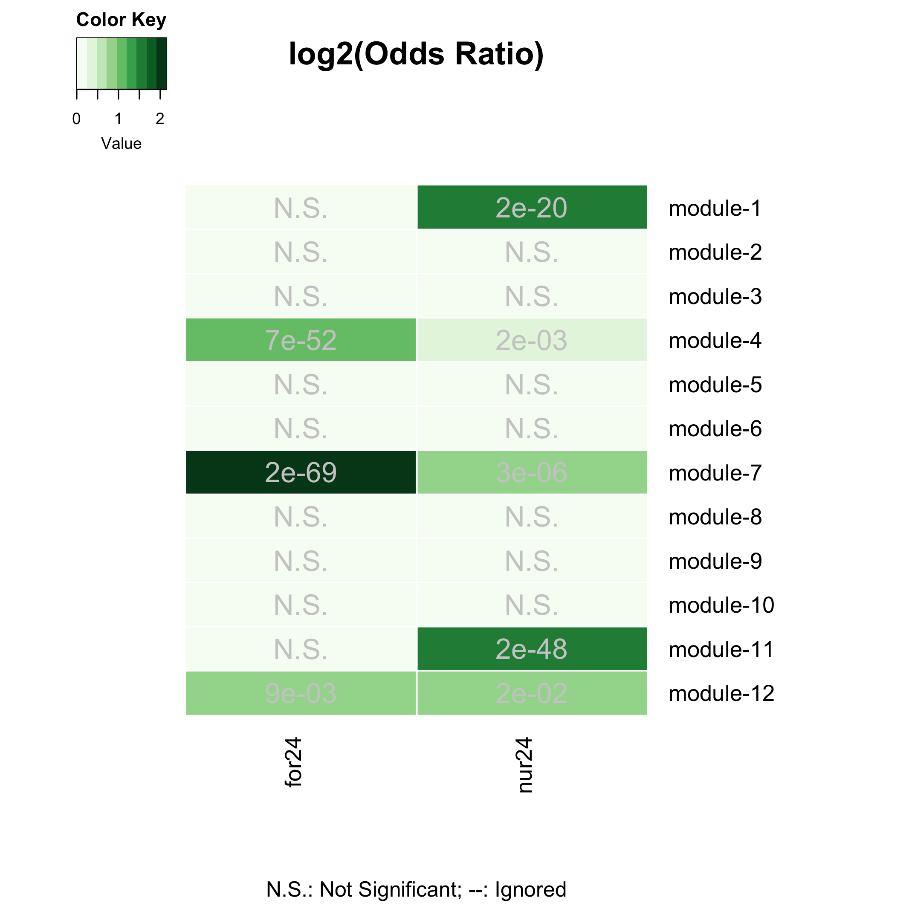

## Overview/Goals

This document provides a step-by-step tutorial on how to: 
- build a circadian gene co-expression network (GCN), 
- how to annotate the network using published data,
- infer functions of your gene-clusters-of-interest.

## Step 1: Build circadian GCN

### 1.1 Load data

We will build a circadian GCN for the ant, *Camponotus floridanus*, using time-course RNASeq data collected in Das and de Bekker (2021; bioRxiv). The raw data is deposited on NCBI under accession number **XXXX**. 

DESCRIBE THE DATA HERE (briefly)

One would need to perform the usual steps - trimming the reads, mapping the reads to the genome, and quantifying normalized gene counts - to obtain normalized gene expression data from the raw reads. At the end, for each gene in the genome, we should have the normalized expression for each time point, throughout the 24h day.

For the purpose of this tutorial, we assume that you have organized the processed data into a (gene-expr X time-point) format as shown below.


```r
# loading database which contains data for Das and de Bekker 2021 (bioRxiv)
db <- dbConnect(RSQLite::SQLite(), paste0(dir.path,"/data/databases/TC5_data.db"))

# extract the (gene-expr X time-point) data
dat <-
  db %>%
  tbl(., "annot_fpkm") %>%
  select(gene_name, X2F:X24N) %>%
  collect()

dim(dat)
```

```
## [1] 13813    25
```

### 1.2 Clean data

The above dataset contains all genes (n=13,813) in the ant genome. 
However, not all of these genes are expressed in the ant brain, and some are expressed at very low levels that are not biologically meaningful. Therefore, we will only keep the genes that are "expressed" (≥1 FPKM) in the ant brain, for at least half of all the sampled time points.


```r
# Which genes are expressed throughout the day in both forager and nurses brains?
daily.exp.genes <-
  tbl(db, "expressed_genes") %>% # note, the information is already available in the database
  filter(exp_half_for == "yes" & exp_half_nur == "yes") %>%
  collect() %>%
  pull(gene_name)

# Subset the gene-expr X time-point file
dat <- dat %>% filter(gene_name %in% daily.exp.genes)
dim(dat)
```

```
## [1] 9139   25
```

This is our cleaned, input data file. 
The daily expression for these 9139 genes that will be used to create the circadian GCN of *Camponotus floridanus*.

### 1.3 Format data

- Log2 transform the data


```r
datExpr = as.data.frame(t(log2(dat[-c(1)]+1)))
names(datExpr) = dat$gene_name
rownames(datExpr) = names(dat)[-c(1)]

# USE THE FOLLOWING CODE TO CHECK IF YOU HAVE ANY BAD SAMPLES #
  # gsg = goodSamplesGenes(datExpr0, verbose = 3);
  # gsg$allOK
  #
  # sampleTree = hclust(dist(datExpr0), method = "average");
  # # Plot the sample tree: Open a graphic output window of size 12 by 9 inches
  # # The user should change the dimensions if the window is too large or too small.
  # sizeGrWindow(12,9)
  # #pdf(file = "Plots/sampleClustering.pdf", width = 12, height = 9);
  # par(cex = 1);
  # par(mar = c(0,4,2,0))
  # plot(sampleTree, main = "Sample clustering to detect outliers", sub="", xlab="", cex.lab = 1.5,
  #      cex.axis = 1.5, cex.main = 2)

# save the number of genes and samples
# that will be used to create the circadian GCN
nGenes = ncol(datExpr)
nSamples = nrow(datExpr)

# visualize the log-transformed data
x = reshape2::melt(as.matrix(t(datExpr)))
colnames(x) = c('gene_id', 'sample', 'value')
ggplot(x, aes(x=value, color=sample)) + geom_density() + theme_Publication()
```

<!-- -->

### 1.4 Calculate gene-gene similarity


```r
## Calculate Kendall's tau-b correlation for each gene-gene pair
#
# sim_matrix <- cor((datExpr), method = "kendall") # this step takes time
# save(sim_matrix, file = paste0(dir.path, "/results/temp_files/sim_matrix_for_nur_TC5.RData")) # might be useful to save the sim_matrix and
load(paste0(dir.path, "/results/temp_files/sim_matrix_for_nur_TC5.RData")) # load it up

## Let's display a chunk of the matrix (code from Hughitt 2016; github)
heatmap_indices <- sample(nrow(sim_matrix), 500)
gplots::heatmap.2(t(sim_matrix[heatmap_indices, heatmap_indices]),
          col=inferno(100),
          labRow=NA, labCol=NA,
          trace='none', dendrogram='row',
          xlab='Gene', ylab='Gene',
          main='Similarity matrix \n correlation method = "kendall" \n (500 random genes)',
          density.info='none', revC=TRUE)
```

<!-- -->

### 1.5 Create adjacency matrix

- To create the adjacency matrix, we need to first identify the soft-thresholding power


```r
# Choose a set of soft-thresholding powers
powers = c(c(1:10), seq(from = 12, to=20, by=2))
# # Call the network topology analysis function
sft = pickSoftThreshold(datExpr, powerVector = powers, verbose = 5)
```

```
## pickSoftThreshold: will use block size 4895.
##  pickSoftThreshold: calculating connectivity for given powers...
##    ..working on genes 1 through 4895 of 9139
##    ..working on genes 4896 through 9139 of 9139
##    Power SFT.R.sq  slope truncated.R.sq mean.k. median.k. max.k.
## 1      1    0.845  1.900          0.995  3310.0   3390.00   4730
## 2      2    0.248  0.276          0.930  1720.0   1710.00   3200
## 3      3    0.343 -0.284          0.907  1050.0    988.00   2410
## 4      4    0.696 -0.580          0.922   701.0    616.00   1930
## 5      5    0.818 -0.762          0.951   499.0    402.00   1600
## 6      6    0.847 -0.896          0.942   371.0    272.00   1360
## 7      7    0.854 -0.992          0.933   285.0    190.00   1180
## 8      8    0.868 -1.060          0.935   225.0    136.00   1030
## 9      9    0.879 -1.110          0.940   181.0     99.10    919
## 10    10    0.874 -1.160          0.928   148.0     73.40    824
## 11    12    0.879 -1.220          0.928   103.0     42.20    676
## 12    14    0.879 -1.280          0.921    74.8     25.40    568
## 13    16    0.874 -1.310          0.916    56.1     15.80    485
## 14    18    0.842 -1.360          0.884    43.2     10.10    420
## 15    20    0.827 -1.390          0.874    34.0      6.64    367
```

```r
# Plot the results:
# sizeGrWindow(9, 5)
# par(mfrow = c(1,2));
cex1 = 0.9;
# Scale-free topology fit index as a function of the soft-thresholding power
plot(sft$fitIndices[,1], -sign(sft$fitIndices[,3])*sft$fitIndices[,2],
     xlab="Soft Threshold (power)",ylab="Scale Free Topology Model Fit,signed R^2",type="n",
     main = paste("Scale independence"));
text(sft$fitIndices[,1], -sign(sft$fitIndices[,3])*sft$fitIndices[,2],
     labels=powers,cex=cex1,col="red");
# this line corresponds to using an R^2 cut-off of h
abline(h=0.90,col="red")
```

<!-- -->

```r
# Mean connectivity as a function of the soft-thresholding power
plot(sft$fitIndices[,1], sft$fitIndices[,5],
     xlab="Soft Threshold (power)",ylab="Mean Connectivity", type="n",
     main = paste("Mean connectivity"))
text(sft$fitIndices[,1], sft$fitIndices[,5], labels=powers, cex=cex1,col="red")
```

<!-- -->

NOTE: The scale-free topology fit index reaches ~0.9 at a soft-thresholding-power=9, and it does not improve drastically beyond that.

Now, we can go ahead and create our adjacency matrix.


```r
## Specify the soft-thresholding-power
soft.power = 9

## Construct adjacency matrix
# adj_matrix <- adjacency.fromSimilarity(sim_matrix,
#                                        power=soft.power,
#                                        type='signed'
#                                         )
# save(adj_matrix, file = paste0(dir.path, "/results/temp_files/adj_matrix_for_nur_TC5.RData")) # might be useful to save the sim_matrix and
load(paste0(dir.path, "/results/temp_files/adj_matrix_for_nur_TC5.RData")) # load it up


# Convert adj_matrix to matrix
gene_ids <- rownames(adj_matrix)

adj_matrix <- matrix(adj_matrix, nrow=nrow(adj_matrix))
rownames(adj_matrix) <- gene_ids
colnames(adj_matrix) <- gene_ids

## Same heatmap as before, but now with the power-transformed adjacency matrix
gplots::heatmap.2(t(adj_matrix[heatmap_indices, heatmap_indices]),
                  col=inferno(100),
                  labRow=NA, labCol=NA,
                  trace='none', dendrogram='row',
                  xlab='Gene', ylab='Gene',
                  main='Adjacency matrix',
                  density.info='none', revC=TRUE)
```

<!-- -->

```r
## Delete similarity matrix to free up memory
rm(sim_matrix)
gc()
```

```
##            used  (Mb) gc trigger   (Mb) limit (Mb)  max used   (Mb)
## Ncells  3914207 209.1    7460897  398.5         NA   7460897  398.5
## Vcells 92806779 708.1  300702737 2294.2      16384 451627338 3445.7
```

***

## Step 2: Identify gene clusters

### 2.1 Create topological overalp matrix


```r
# Turn adjacency into topological overlap
# TOM = TOMsimilarity(adj_matrix);
# dissTOM = 1-TOM
# save(dissTOM, file = paste0(dir.path, "/results/temp_files/dissTOM_for_nur_TC5.RData")) # might be useful to save the sim_matrix and
load(paste0(dir.path, "/results/temp_files/dissTOM_for_nur_TC5.RData")) # load it up

# Call the hierarchical clustering function
geneTree = hclust(as.dist(dissTOM), method = "average")

# Plot the resulting clustering tree (dendrogram)
# sizeGrWindow(12,9)
plot(geneTree, xlab="", sub="", main = "Gene clustering on TOM-based dissimilarity",
     labels = FALSE, hang = 0.04)
```

<!-- -->

### 2.2 Identify clusters


```r
# We like large modules, so we set the minimum module size relatively high:
minModuleSize = 30;

# Module identification using dynamic tree cut:
dynamicMods= cutreeDynamic(dendro = geneTree,
                           distM = dissTOM,
                           method = "hybrid",
                           verbose = 4,
                           deepSplit = 3, # see WGCNA for more info on tuning parameters
                           pamRespectsDendro = FALSE,
                           minClusterSize = minModuleSize);
```

```
##  ..cutHeight not given, setting it to 0.99  ===>  99% of the (truncated) height range in dendro.
##  ..Going through the merge tree
##  
##  ..Going through detected branches and marking clusters..
##  ..Assigning Tree Cut stage labels..
##  ..Assigning PAM stage labels..
##  ....assigned 5531 objects to existing clusters.
##  ..done.
```

```r
# view number of genes in each module
table(dynamicMods)
```

```
## dynamicMods
##    1    2    3    4    5    6    7    8    9   10   11   12   13   14   15   16 
## 1337 1172  742  723  720  579  515  506  369  299  269  265  199  149  134  134 
##   17   18   19   20   21   22   23   24   25   26   27   28   29   30 
##  112  107   99   91   88   79   75   72   66   56   55   50   45   32
```

```r
# Convert numeric lables into colors
dynamicColors = labels2colors(dynamicMods)
table(dynamicColors)
```

```
## dynamicColors
##         black          blue         brown          cyan     darkgreen 
##           515          1172           742           149            79 
##      darkgrey    darkorange       darkred darkturquoise         green 
##            72            56            88            75           720 
##   greenyellow        grey60     lightcyan    lightgreen   lightyellow 
##           269           112           134           107            99 
##       magenta  midnightblue        orange          pink        purple 
##           369           134            66           506           299 
##           red     royalblue   saddlebrown        salmon       skyblue 
##           579            91            45           199            50 
##     steelblue           tan     turquoise         white        yellow 
##            32           265          1337            55           723
```

### 2.3 Merge similar modules


```r
# Calculate eigengenes
MEList = moduleEigengenes(datExpr, colors = dynamicColors)
MEs = MEList$eigengenes

# Calculate dissimilarity of module eigengenes
MEDiss = 1-cor(MEs, method = "kendall");

# Cluster module eigengenes
METree = hclust(as.dist(MEDiss), method = "average");
# Plot the result
# sizeGrWindow(7, 8)
plot(METree, main = "Clustering of module eigengenes",
     xlab = "", sub = "MEDiss = 1-cor(MEs, method = 'kendall')")

# We choose a height cut of 0.2, corresponding to correlation of 0.8, to merge
MEDissThres = 0.2 # user-specified parameter value; see WGCNA manual for more info

# Plot the cut line into the dendrogram
abline(h=MEDissThres, col = "red")
```

<!-- -->

```r
# Call an automatic merging function
merge = mergeCloseModules(datExpr, dynamicColors, cutHeight = MEDissThres, verbose = 3)
```

```
##  mergeCloseModules: Merging modules whose distance is less than 0.2
##    multiSetMEs: Calculating module MEs.
##      Working on set 1 ...
##      moduleEigengenes: Calculating 30 module eigengenes in given set.
##    multiSetMEs: Calculating module MEs.
##      Working on set 1 ...
##      moduleEigengenes: Calculating 13 module eigengenes in given set.
##    multiSetMEs: Calculating module MEs.
##      Working on set 1 ...
##      moduleEigengenes: Calculating 12 module eigengenes in given set.
##    Calculating new MEs...
##    multiSetMEs: Calculating module MEs.
##      Working on set 1 ...
##      moduleEigengenes: Calculating 12 module eigengenes in given set.
```

```r
# The merged module colors
mergedColors = merge$colors;
# Eigengenes of the new merged modules:
mergedMEs = merge$newMEs;

# sizeGrWindow(12, 9)
plotDendroAndColors(geneTree,
                    cbind(dynamicColors, mergedColors),
                    c("Dynamic Tree Cut", "Merged dynamic"),
                    dendroLabels = FALSE, hang = 0.03,
                    addGuide = TRUE, guideHang = 0.05)
```

<!-- -->

```r
# Rename to moduleColors
moduleColors = mergedColors

# Construct numerical labels corresponding to the colors
colorOrder = c("grey", standardColors(50));
moduleLabels = match(moduleColors, colorOrder)-1
```

### 2.4 Calculate module-module similarity


```r
# Calculate similarity of the eigen-genes
sim_matrix_ME <- cor(mergedMEs, method = "kendall")

# calculate adj_matrix
adj_matrix_ME <- adjacency.fromSimilarity(sim_matrix_ME,
                                          power=1, # DO NOT power transform
                                          type='signed'
)

# coerce into a matrix
gene_ids <- rownames(adj_matrix_ME)
adj_matrix_ME <- matrix(adj_matrix_ME, nrow=nrow(adj_matrix_ME))
rownames(adj_matrix_ME) <- gene_ids
colnames(adj_matrix_ME) <- gene_ids

gplots::heatmap.2(t(adj_matrix_ME),
                  col=inferno(100),
                  # labRow=NA, labCol=NA,
                  trace='none', dendrogram='row',
                  xlab='', ylab='',
                  # main='Similarity matrix - MEs \n correlation method = "kendall")',
                  main='Adjacency matrix - MEs \n modified edge weights)',
                  density.info='none', revC=TRUE)
```

<!-- -->

### 2.5 Visualize the network


```r
pacman::p_load(igraph)

# get rid of low correlations (0.6 & 0.8 are arbitrary)
adj_matrix_ME[adj_matrix_ME < 0.6] <- 0
adj_matrix_ME[adj_matrix_ME < 0.8 & adj_matrix_ME>0] <- 0.5
adj_matrix_ME[adj_matrix_ME >= 0.8] <- 1

# build_network
network <- graph.adjacency(adj_matrix_ME,
                           mode = "upper",
                           weighted = T,
                           diag = F)

# simplify network
network <- igraph::simplify(network)  # removes self-loops

# E(network)$width <- E(network)$weight + min(E(network)$weight) + 1 # offset=1

colors <- mergedMEs %>% names() %>% str_split("ME", 2) %>% sapply("[", 2)
V(network)$color <- colors

genes_ME <- factor(moduleColors, levels=colors) %>% summary()
V(network)$size <- log2(genes_ME)*2

V(network)$label.color <- "black"
V(network)$frame.color <- "white"

E(network)$width <- E(network)$weight^2*4
E(network)$edge.color <- "gray80"

# par(mar=c(0,0,0,0))
# remove unconnected nodes
# network <- delete.vertices(network, degree(network)==0)
# plot(network,
#      layout=layout.fruchterman.reingold
#      # layout = layout.kamada.kawai
#      # layout = layout.kamada.kawai
#      )


## Circular layout
plot(network,
     layout=layout.kamada.kawai
       # layout=layout.fruchterman.reingold
       # layout=layout.graphopt
       # layout=layout_in_circle,
     # vertex.label=NA
     # vertex.size=hub.score(network)$vector*30
     # vertex.shape="none"
)
```

<!-- -->

## Step 3: Annotate the network

### 3.1 Define your genes of interest


```r
# DEFINE GENES OF INTEREST

rhy.trait.24 <- tbl(db, "ejtk_all") %>% select(gene_name:rhy) %>% collect()
# pull the genes
for.rhy <- rhy.trait.24 %>% filter(caste=="for" & rhy=="yes") %>% pull(gene_name)
nur.rhy <- rhy.trait.24 %>% filter(caste=="nur" & rhy=="yes") %>% pull(gene_name)
rhy.genes <- dplyr::union(for.rhy, nur.rhy)

rhy.trait.8 <- tbl(db, "ejtk_8h_all") %>% select(gene_name:rhy) %>% collect()
for.rhy.8 <- rhy.trait.8 %>% filter(caste=="for" & rhy=="yes") %>% pull(gene_name)
nur.rhy.8 <- rhy.trait.8 %>% filter(caste=="nur" & rhy=="yes") %>% pull(gene_name)

rhy.trait.12 <- tbl(db, "ejtk_12h_all") %>% select(gene_name:rhy) %>% collect()
for.rhy.12 <- rhy.trait.12 %>% filter(caste=="for" & rhy=="yes") %>% pull(gene_name)
nur.rhy.12 <- rhy.trait.12 %>% filter(caste=="nur" & rhy=="yes") %>% pull(gene_name)

# DRGs
for24.nur8 <- intersect(for.rhy, nur.rhy.8)
```

### 3.2 Where are my genes of interest located?


```r
pacman::p_load(GeneOverlap)
# https://www.bioconductor.org/packages/devel/bioc/vignettes/GeneOverlap/inst/doc/GeneOverlap.pdf

# Make a list that returns gene names for a given cluster
module_color = colors
module = names(mergedMEs)
module_colors <-
  data.frame(module_label=module) %>%
  mutate(module_color = str_replace(module_label, "ME", ""))

module_genes <- list()
module_color <- module_colors$module_color
# Get the genes from each of the modules
for (i in 1:length(module_color)) {

  module_genes[[i]] <- names(datExpr)[which(moduleColors==module_color[[i]])]
  names(module_genes)[[i]] <- module_color[[i]]
}
# check the result | works
names(module_genes)
```

```
##  [1] "greenyellow"   "darkorange"    "salmon"        "grey60"       
##  [5] "darkgrey"      "darkred"       "black"         "steelblue"    
##  [9] "darkturquoise" "orange"        "darkgreen"     "saddlebrown"
```

```r
# module_genes['salmon']


## MAKE YOUR LIST OF GENES OF INTEREST ##

# LIST ONE - WGCNA modules
list1 <- module_genes
sapply(list1, length)
```

```
##   greenyellow    darkorange        salmon        grey60      darkgrey 
##           403            56           922          2269           127 
##       darkred         black     steelblue darkturquoise        orange 
##           179           664          2616           209            66 
##     darkgreen   saddlebrown 
##          1533            95
```

```r
## LIST TWO - rhythmic genes
list2 <- list(for.rhy, nur.rhy, rhy.genes, intersect(for.rhy, nur.rhy), for24.nur8)
names(list2) <- c("for24", "nur24", "all.rhy24","for24.nur24", "for24.nur8")
sapply(list2, length)
```

```
##       for24       nur24   all.rhy24 for24.nur24  for24.nur8 
##        3569        1367        4242         694         291
```

```r
## CHECK FOR OVERLAP

## make a GOM object
gom.1v2 <- newGOM(list1, list2,
       genome.size = nGenes)
png(paste0(dir.path, "/results/figures/gom_1v2.png"), 
    width = 20, height = 18, units = "cm", res = 300)
drawHeatmap(gom.1v2,
              adj.p=T,
              cutoff=0.05,
              what="odds.ratio",
              # what="Jaccard",
              log.scale = T,
              note.col = "grey80")
dev.off()
```

```
## quartz_off_screen 
##                 2
```


<div class="figure" style="text-align: center">

<p class="caption">Gene-clusters with 24h-rhythmic genes</p>
</div>

The above plot shows the gene-clusters that contain most of our 24h-rhythmic genes of interest.

HOW TO READ THE FIGURE?
- Briefly explain here
- Talk about Odds-Ratio
- Darker the green, more significant is the overlap (also indicated by the adj_pval)

Next, we can try to identify the ant gene-clusters that underlie behavioral plasticity, as well as the ant clusters that are affected during behavioral manipulation induced by *Ophiocordyceps*.


```r
## Genes underlying behavioral plasticity
  ## DEGS (foragers v. nurses)
  # genes higher expressed in forager brains (v. nurse brains)
  for.up <- tbl(db, "TC5_DEGs_all") %>% filter(upregulation=="for") %>% collect() %>% pull(gene_name)
  # genes lower expressed in for. brains (v. nurse brains)
  for.down <- tbl(db, "TC5_DEGs_all") %>% filter(upregulation=="nur") %>% collect() %>% pull(gene_name)

## Genes underlying parasite-induced behavioral manipulation
  ## DEGs (ophio-ant v. control-ant)
  ophio.dat <- tbl(db, "ophio_biting_control") %>% collect() %>% select(gene, value_1, value_2, q_value:logFC)
  ophio.dat <- ophio.dat %>%
    filter(abs(logFC) >= 1 & significant=="yes" & q_value < 0.05) %>%
    mutate(ophio = ifelse(logFC > 0, "down", "up"))
  # genes higher expressed in ant heads during Ophio-manipulated biting (v. controls)
  ophio.up <- ophio.dat %>% filter(ophio=="up") %>% pull(gene)
  # genes lower expressed in ant heads during manipulated biting (v. controls)
  ophio.down <- ophio.dat %>% filter(ophio=="down") %>% pull(gene)

## LIST THREE - genes underlying behavioral plasticity and parasitic behavioral manipulation
list3 <- list(for.up, for.down, # same as list three
              ophio.up, ophio.down)
names(list3) <- c("for-UP", "for-DOWN",
                  "ophio-UP", "ophio-DOWN")

## CHECK FOR OVERLAP

## make a GOM object
gom.1v3 <- newGOM(list1, list3,
       genome.size = nGenes)
## visualize the overlaps
png(paste0(dir.path, "/results/figures/gom_1v3.png"), 
    width = 20, height = 18, units = "cm", res = 300)
drawHeatmap(gom.1v3,
              adj.p=T,
              cutoff=0.05,
              what="odds.ratio",
              # what="Jaccard",
              log.scale = T,
              note.col = "grey80")
dev.off()
```

```
## quartz_off_screen 
##                 2
```

<div class="figure" style="text-align: center">

<p class="caption">Gene-clusters underlying behavioral plasiticity and parasitic behavioral manipulation</p>
</div>

The figure above clearly indicates that the gene-clusters that underlie behavioral plasticity (caste differentiation) and the ones that are affected during *Ophiocordycpes*-induced behavioral manipulation are the same. 

**In other words, to induce the characteristic manipulated biting behavior, the manipulating fungal parasite seems to be targeting the same genes and processes that otherwise allow ants to display behavioral plasticity.**


## Step 4: Explore your clusters-of-interest

### 4.1 What are these overlapping genes?

- Let's focus on the cluster darkturquoise that contains most Cflo genes that:
  - are sig. higher expressed in foragers (v. nurses) and 
  - are sig. up-regulated in forager heads during behavioral manipulation (v. uninfected foragers)


```r
# specify our cluster of interest (coi)
coi.1 <- "darkturquoise"
# How many genes are there in the cluster?
module_genes[[coi.1]] %>% length() # n = 209 genes
```

```
## [1] 209
```

```r
# specify our genes of interest (goi)
goi.1 <- ophio.up
# how many genes are there in the gene-set?
goi.1 %>% length() # n = 232 genes
```

```
## [1] 232
```

```r
# Identify overlapping genes
overlapping.genes.1 <- intersect(module_genes[[coi.1]], goi.1) # n = 32 genes
# what are these genes?
overlapping.genes.1.annot <- 
  db %>% 
  tbl(., "annot_fpkm") %>% 
  filter(gene_name %in% overlapping.genes.1) %>% 
  select(gene_name, 
         blast_annot=old_annotation, 
         GOs, pfams, signalP, TMHMM) %>% 
  collect()

# Visualize the results
DT::datatable(overlapping.genes.1.annot, options = list(
  pageLength = 5,
  lengthMenu = c(5, 10, 15, 20)
))
```

<!--html_preserve--><div id="htmlwidget-d09a579d97f0a6d2232f" style="width:100%;height:auto;" class="datatables html-widget"></div>
<script type="application/json" data-for="htmlwidget-d09a579d97f0a6d2232f">{"x":{"filter":"none","data":[["1","2","3","4","5","6","7","8","9","10","11","12","13","14","15","16","17","18","19","20","21","22","23","24","25","26","27","28","29","30","31","32"],["LOC105248308","LOC105248455","LOC105248993","LOC105249672","LOC105250427","LOC105250918","LOC105250953","LOC105251065","LOC105251392","LOC105251468","LOC105251939","LOC105253135","LOC105253350","LOC105253380","LOC105253462","LOC105253608","LOC105253917","LOC105254189","LOC105254493","LOC105254571","LOC105254579","LOC105254945","LOC105255413","LOC105255546","LOC105255939","LOC105256167","LOC105256258","LOC105256264","LOC105256622","LOC105256803","LOC105258312","LOC105259120"],["calcium-binding mitochondrial carrier protein SCaMC-2 isoform X1","serine protease persephone","glutamate receptor 3-like","cyclin-dependent kinase 4","uncharacterized protein LOC105250427","uncharacterized protein LOC105250918","uncharacterized protein LOC105250953","annexin B9 isoform X2","glutamate--cysteine ligase regulatory subunit","uncharacterized protein LOC105251468","hairy/enhancer-of-split related with YRPW motif protein 2 isoform X1","dual oxidase","AN1-type zinc finger protein 2A","uncharacterized protein LOC105253380","LOW QUALITY PROTEIN: dynein heavy chain 7, axonemal","ETS-related transcription factor Elf-5","BAG domain-containing protein Samui isoform X1","uncharacterized protein LOC105254189 isoform X2","thyroid receptor-interacting protein 6","myosin-IA","X-box-binding protein 1","angiotensin-converting enzyme 2","matrix metalloproteinase-14 isoform X3","putative phosphatidate phosphatase isoform X1","uncharacterized protein LOC105255939 isoform X1","alpha-(1,3)-fucosyltransferase C","protein hairy","histone H2A","ceramide glucosyltransferase","L-lactate dehydrogenase","uncharacterized protein LOC105258312","uncharacterized protein LOC105259120"],["GO:0005509|calcium ion binding","GO:0004252|serine-type endopeptidase activity; GO:0006508|proteolysis","GO:0004970|ionotropic glutamate receptor activity; GO:0016020|membrane","GO:0004672|protein kinase activity; GO:0005524|ATP binding; GO:0006468|protein phosphorylation",null,null,null,"GO:0005509|calcium ion binding; GO:0005544|calcium-dependent phospholipid binding","GO:0006750|glutathione biosynthetic process; GO:0035226|glutamate-cysteine ligase catalytic subunit binding","GO:0003700|DNA-binding transcription factor activity; GO:0006355|regulation of transcription, DNA-templated","GO:0003677|DNA binding; GO:0006355|regulation of transcription, DNA-templated; GO:0046983|protein dimerization activity","GO:0005509|calcium ion binding; GO:0016174|NAD(P)H oxidase activity; GO:0050665|hydrogen peroxide biosynthetic process; GO:0055114|oxidation-reduction process","GO:0008270|zinc ion binding",null,"GO:0003777|microtubule motor activity; GO:0005524|ATP binding; GO:0007018|microtubule-based movement; GO:0030286|dynein complex","GO:0003700|DNA-binding transcription factor activity; GO:0005634|nucleus; GO:0006355|regulation of transcription, DNA-templated; GO:0043565|sequence-specific DNA binding","GO:0051087|chaperone binding",null,null,"GO:0003774|motor activity; GO:0005515|protein binding; GO:0005524|ATP binding; GO:0016459|myosin complex","GO:0003700|DNA-binding transcription factor activity; GO:0006355|regulation of transcription, DNA-templated","GO:0006508|proteolysis; GO:0008237|metallopeptidase activity; GO:0008241|peptidyl-dipeptidase activity; GO:0016020|membrane","GO:0004222|metalloendopeptidase activity; GO:0006508|proteolysis; GO:0008270|zinc ion binding; GO:0031012|extracellular matrix",null,"GO:0005089|Rho guanyl-nucleotide exchange factor activity; GO:0035023|regulation of Rho protein signal transduction","GO:0006486|protein glycosylation; GO:0008417|fucosyltransferase activity; GO:0016020|membrane","GO:0003677|DNA binding; GO:0006355|regulation of transcription, DNA-templated; GO:0046983|protein dimerization activity","GO:0000786|nucleosome; GO:0003677|DNA binding","GO:0016757|transferase activity, transferring glycosyl groups","GO:0016616|oxidoreductase activity, acting on the CH-OH group of donors, NAD or NADP as acceptor; GO:0055114|oxidation-reduction process",null,null],["PF00153|Mitochondrial carrier protein; PF00153|Mitochondrial carrier protein; PF00153|Mitochondrial carrier protein; PF13499|EF-hand domain pair; PF13499|EF-hand domain pair","PF00089|Trypsin","PF10613|Ligated ion channel L-glutamate- and glycine-binding site; PF00060|Ligand-gated ion channel","PF00069|Protein kinase domain",null,null,null,"PF00191|Annexin; PF00191|Annexin; PF00191|Annexin; PF00191|Annexin","PF00248|Aldo/keto reductase family","PF07716|Basic region leucine zipper","PF00010|Helix-loop-helix DNA-binding domain; PF07527|Hairy Orange","PF08030|Ferric reductase NAD binding domain; PF13499|EF-hand domain pair; PF03098|Animal haem peroxidase; PF00036|EF hand; PF01794|Ferric reductase like transmembrane component; PF08022|FAD-binding domain","PF01428|AN1-like Zinc finger; PF01428|AN1-like Zinc finger",null,"PF18198|Dynein heavy chain AAA lid domain; PF12780|P-loop containing dynein motor region D4; PF12774|Hydrolytic ATP binding site of dynein motor region; PF17857|AAA+ lid domain; PF17852|Dynein heavy chain AAA lid domain; PF08393|Dynein heavy chain, N-terminal region 2; PF03028|Dynein heavy chain region D6 P-loop domain; PF12781|ATP-binding dynein motor region; PF18199|Dynein heavy chain C-terminal domain; PF12777|Microtubule-binding stalk of dynein motor; PF12775|P-loop containing dynein motor region","PF02198|Sterile alpha motif (SAM)/Pointed domain; PF00178|Ets-domain","PF02179|BAG domain","PF13639|Ring finger domain","PF00412|LIM domain; PF00412|LIM domain; PF00412|LIM domain","PF00063|Myosin head (motor domain); PF06017|Unconventional myosin tail, actin- and lipid-binding; PF00612|IQ calmodulin-binding motif","PF07716|Basic region leucine zipper","PF01401|Angiotensin-converting enzyme","PF00413|Matrixin; PF00045|Hemopexin; PF00045|Hemopexin; PF00045|Hemopexin; PF00045|Hemopexin; PF01471|Putative peptidoglycan binding domain","PF01569|PAP2 superfamily","PF00621|RhoGEF domain","PF17039|Fucosyltransferase, N-terminal; PF00852|Glycosyltransferase family 10 (fucosyltransferase) C-term","PF00010|Helix-loop-helix DNA-binding domain; PF07527|Hairy Orange","PF16211|C-terminus of histone H2A; PF00125|Core histone H2A/H2B/H3/H4","PF13506|Glycosyl transferase family 21","PF00056|lactate/malate dehydrogenase, NAD binding domain; PF02866|lactate/malate dehydrogenase, alpha/beta C-terminal domain","PF00100|Zona pellucida-like domain",null],[0,1,1,0,0,0,0,0,0,0,0,1,0,1,0,0,0,0,0,0,0,1,0,0,0,0,0,0,0,0,3,3],[0,0,3,0,0,0,0,0,0,0,0,7,0,1,0,0,0,2,0,0,0,1,0,6,0,1,0,0,3,0,1,0]],"container":"<table class=\"display\">\n  <thead>\n    <tr>\n      <th> <\/th>\n      <th>gene_name<\/th>\n      <th>blast_annot<\/th>\n      <th>GOs<\/th>\n      <th>pfams<\/th>\n      <th>signalP<\/th>\n      <th>TMHMM<\/th>\n    <\/tr>\n  <\/thead>\n<\/table>","options":{"pageLength":5,"lengthMenu":[5,10,15,20],"columnDefs":[{"className":"dt-right","targets":[5,6]},{"orderable":false,"targets":0}],"order":[],"autoWidth":false,"orderClasses":false}},"evals":[],"jsHooks":[]}</script><!--/html_preserve-->

Which genes in darkturquoise show overlap with both genes of interests?


```r
# define the second gene-set of interst
goi.2 <- for.up
# how many genes are up-regulated during manipulation?
goi.2 %>% length() # n = 34 genes
```

```
## [1] 34
```

```r
# Identify overlapping.genes
overlapping.genes.2 <- intersect(overlapping.genes.1, goi.2) # n = 10 genes
# what are these genes?
overlapping.genes.2.annot <- 
  db %>% 
  tbl(., "annot_fpkm") %>% 
  filter(gene_name %in% overlapping.genes.2) %>% 
  select(gene_name, 
         blast_annot=old_annotation, 
         GOs, pfams, signalP, TMHMM) %>% 
  collect()

# Visualize the results
DT::datatable(overlapping.genes.2.annot, options = list(
  pageLength = 5,
  lengthMenu = c(5, 10, 15, 20)
))
```

<!--html_preserve--><div id="htmlwidget-89f28528f27cc947ce55" style="width:100%;height:auto;" class="datatables html-widget"></div>
<script type="application/json" data-for="htmlwidget-89f28528f27cc947ce55">{"x":{"filter":"none","data":[["1","2","3","4","5","6","7","8","9","10"],["LOC105249672","LOC105250427","LOC105250918","LOC105251392","LOC105251468","LOC105253608","LOC105254189","LOC105255413","LOC105256264","LOC105259120"],["cyclin-dependent kinase 4","uncharacterized protein LOC105250427","uncharacterized protein LOC105250918","glutamate--cysteine ligase regulatory subunit","uncharacterized protein LOC105251468","ETS-related transcription factor Elf-5","uncharacterized protein LOC105254189 isoform X2","matrix metalloproteinase-14 isoform X3","histone H2A","uncharacterized protein LOC105259120"],["GO:0004672|protein kinase activity; GO:0005524|ATP binding; GO:0006468|protein phosphorylation",null,null,"GO:0006750|glutathione biosynthetic process; GO:0035226|glutamate-cysteine ligase catalytic subunit binding","GO:0003700|DNA-binding transcription factor activity; GO:0006355|regulation of transcription, DNA-templated","GO:0003700|DNA-binding transcription factor activity; GO:0005634|nucleus; GO:0006355|regulation of transcription, DNA-templated; GO:0043565|sequence-specific DNA binding",null,"GO:0004222|metalloendopeptidase activity; GO:0006508|proteolysis; GO:0008270|zinc ion binding; GO:0031012|extracellular matrix","GO:0000786|nucleosome; GO:0003677|DNA binding",null],["PF00069|Protein kinase domain",null,null,"PF00248|Aldo/keto reductase family","PF07716|Basic region leucine zipper","PF02198|Sterile alpha motif (SAM)/Pointed domain; PF00178|Ets-domain","PF13639|Ring finger domain","PF00413|Matrixin; PF00045|Hemopexin; PF00045|Hemopexin; PF00045|Hemopexin; PF00045|Hemopexin; PF01471|Putative peptidoglycan binding domain","PF16211|C-terminus of histone H2A; PF00125|Core histone H2A/H2B/H3/H4",null],[0,0,0,0,0,0,0,0,0,3],[0,0,0,0,0,0,2,0,0,0]],"container":"<table class=\"display\">\n  <thead>\n    <tr>\n      <th> <\/th>\n      <th>gene_name<\/th>\n      <th>blast_annot<\/th>\n      <th>GOs<\/th>\n      <th>pfams<\/th>\n      <th>signalP<\/th>\n      <th>TMHMM<\/th>\n    <\/tr>\n  <\/thead>\n<\/table>","options":{"pageLength":5,"lengthMenu":[5,10,15,20],"columnDefs":[{"className":"dt-right","targets":[5,6]},{"orderable":false,"targets":0}],"order":[],"autoWidth":false,"orderClasses":false}},"evals":[],"jsHooks":[]}</script><!--/html_preserve-->

### 4.2 What's special about my cluster?

Now that we know that the module **darkturquoise** contains most of our genes of interest, we can infer its function (enriched GOs and PFAMs) and also identify the genes that are important for the cluster to be functional (i.e., hub genes).

This is the primary advantage of systems-level analysis:
- Use different sources of evidence to identify the clusters in the network that are of interest,
- Analyze the cluster-of-interest

#### 4.2.1 Enriched GO terms

First up, let's see which processes are overrepresented in the cluster.


```r
# To run a functional enrichment analyis, we first need to define the set of background genes; for our purpose, we will use the 9139 genes that we used to build our circadian GCN
bg.genes <- dat %>% pull(gene_name)

# Run the enrichment function (note, GO HERE TO READ MORE ABOUT THIS FUNCTION)
go_enrichment(geneset = module_genes[[coi.1]],
              function.dir = dir.path,
                org = "cflo", 
                bg = bg.genes) %>% 
  
  # visualize the results
  go_enrichment_plot(function.dir = dir.path)
```

```
## [1] "Loading annotation file for Camponotus floridanus"
## [1] "Done."
## [1] "Number of genes in background geneset: 9139"
## [1] "Number of genes in the test set: 209"
## [1] "--------------------------------"
## [1] "Number of GO terms in background geneset: 1968"
## [1] "Number of GO terms (at least 5genes) in background geneset: 373"
## [1] "Number of GO terms (at least 5genes) in test set: 13"
## [1] "Testing for enrichment..."
```

<!-- -->

#### 4.2.2 Daily rhythms?

Second, let's plot the daily expression patterns of all genes in the cluster, for nurses and foragers.


```r
# Obtain the stacked z-plots for nurses (blue) and foragers (red)
zplots <- 
  module_genes[[coi.1]] %>% 
  stacked.zplot()

# Plot them side by side
zplots[[1]] / zplots[[2]]
```

<!-- -->

LEGEND: **RED** = Forager brains, **BLUE** = Nurse brains


### 4.3 
